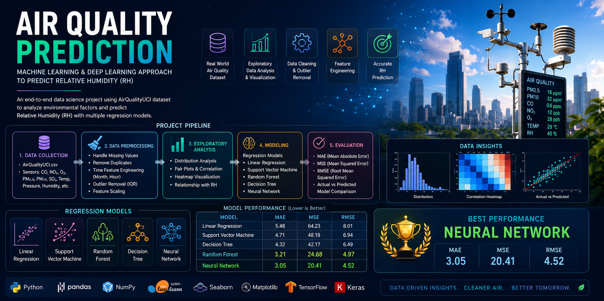

# 🌫️ Air Quality Prediction using Machine Learning & Deep Learning

<p align="center">
  
</p>

## 📌 Overview

This project is an end-to-end **machine learning and deep learning pipeline** for predicting **Relative Humidity (RH)** using the **AirQualityUCI dataset**.

It includes full data preprocessing, exploratory data analysis (EDA), feature engineering, outlier handling, multiple regression models, and a neural network for performance comparison.

---

## 🎯 Objective

To develop and compare different machine learning models that predict **Relative Humidity (RH)** based on environmental and sensor data.

---

## 📊 Dataset Information

- **Dataset:** AirQualityUCI
- **Type:** Time-series environmental sensor data
- **Samples:** ~9,000 records
- **Target Variable:** Relative Humidity (RH)

### Features include:
- CO(GT), NOx(GT), NO2(GT)
- Temperature
- Time-based features (Hour, Month)
- Other air quality sensor measurements

---

## ⚙️ Project Workflow

### 1. Data Preprocessing
- Handling missing values
- Removing duplicates
- Dropping irrelevant columns
- Converting Date → Month
- Extracting Hour from Time column

---

### 2. Exploratory Data Analysis (EDA)
- Distribution analysis
- Boxplots for outliers
- Pairplots for relationships
- Correlation heatmap

---

### 3. Outlier Detection & Handling
- Interquartile Range (IQR) method
- Clipping extreme values instead of removal
- Data distribution stabilization

---

### 4. Feature Scaling
- StandardScaler normalization applied to all features before training

---

## 🤖 Machine Learning Models

The following regression models were trained and evaluated:

- Linear Regression
- Support Vector Regression (SVR)
- Random Forest Regressor
- Decision Tree Regressor

---

## 🧠 Deep Learning Model

A fully connected **Artificial Neural Network (ANN)** built using TensorFlow/Keras:

- Dense layers (ReLU activation)
- Dropout regularization
- Adam optimizer
- EarlyStopping callback
- ReduceLROnPlateau scheduler

---

## 📈 Evaluation Metrics

Models are evaluated using:

- Mean Absolute Error (MAE)
- Mean Squared Error (MSE)
- Root Mean Squared Error (RMSE)

---

## 🏆 Model Performance Summary

| Model              | Performance Insight |
|-------------------|--------------------|
| Random Forest      | Best overall classical ML model |
| Neural Network     | Strong generalization capability |
| Decision Tree      | High variance (overfitting tendency) |
| SVR                | Moderate performance |
| Linear Regression  | Baseline model |

---

## 📉 Visualizations

This project includes:

- Feature distribution plots
- Boxplots (outlier detection)
- Correlation heatmap
- Pairplots
- Actual vs Predicted plots
- Neural network training loss curves

---

## 🧠 Key Insights

- Environmental data is highly non-linear
- Tree-based models outperform linear models
- Feature scaling improves model stability
- Outlier removal significantly improves accuracy
- Neural networks perform well on structured tabular data

---

## 🛠️ Tech Stack

- Python 🐍
- NumPy
- Pandas
- Scikit-learn
- TensorFlow / Keras
- Matplotlib
- Seaborn
- Plotly

---

## 🚀 How to Run This Project

```bash
# Clone repository
git clone https://github.com/ZahraAlipour703/AirQuality.git

# Install dependencies
pip install -r requirements.txt

# Run Jupyter Notebook
jupyter notebook

---

# Author

**Zahra Alipour**

Computer Vision Engineer

---
